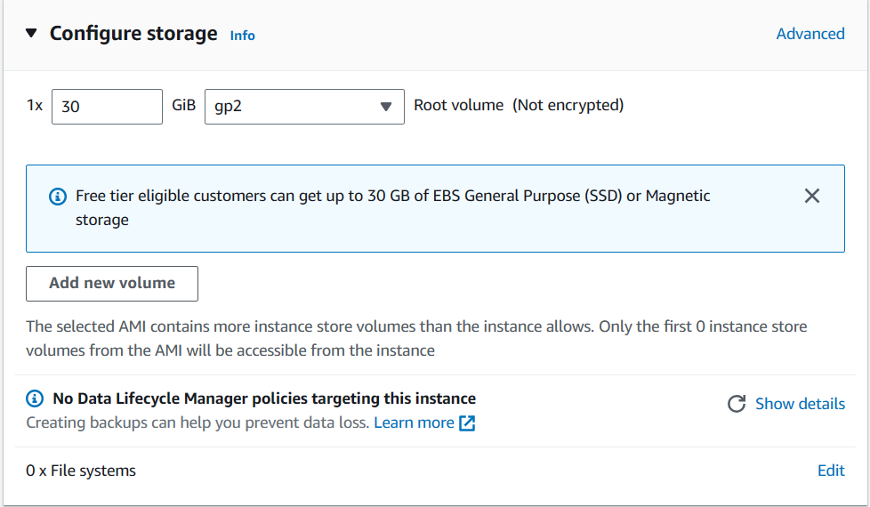
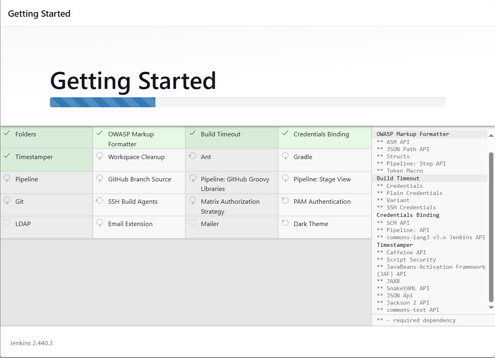

# _The Market Navigator:_

In our graduation project, we intend to develop a platform with a focus on e-commerce endeavors. From the perspective of potential customers, envision a scenario where one desires to purchase a specific product, such as a smartwatch. Through our website, users will have the capability to input product details, including specifications, initiating a search. Subsequently, we will furnish a comprehensive list of retail establishments situated within the preferred vicinity, facilitating price comparison and perusal of consumer feedback. This affords users the opportunity to make informed decisions based on pricing and product reviews, ensuring an optimal shopping experience.

Furthermore, we will curate an extensive inventory encompassing various e-commerce platforms such as Amazon, Noon, and Jumia. This enables aficionados of online shopping to conduct comparative analyses across different platforms, thereby empowering them to select the most suitable option based on their preferences and requirements. In essence, our objective is to meticulously survey the market landscape to offer users access to competitive pricing and superior product quality.

On the other hand, from the perspective of retail store proprietors, our platform serves as a conduit for effective product marketing. We facilitate their engagement by enabling them to establish accounts and showcase their merchandise. Consequently, when a prospective buyer conducts a search, our system seamlessly recommends these products to their target demographic, complete with comprehensive details to facilitate direct engagement and eventual purchase.

## Technologies Used

- **Frontend:**
  - React: Our frontend is developed using React, a JavaScript library for building user interfaces, known for its simplicity, flexibility, and high performance.
- **Backend:**
  - ASP.NET Core: Our backend is built using ASP.NET Core, a cross-platform, high-performance framework for building modern, cloud-based, internet-connected applications.
- **Database:**
  - Microsoft SQL Server: We utilize Microsoft SQL Server as our database management system for storing and managing data.
- **Infrastructure:**
  - AWS (Amazon Web Services): Our infrastructure is hosted on AWS, a comprehensive cloud computing platform offering a wide range of services, including computing power, storage, and networking capabilities.
    - VPC: Amazon Virtual Private Cloud (AWS VPC) is a service that allows you to create a logically isolated network within the AWS cloud, enabling you to define and control a virtual networking environment. With AWS VPC, you can launch AWS resources, such as EC2 instances, into a virtual network that you've defined, providing complete control over your network configuration, including IP address ranges, subnets, route tables, and network gateways.
    - AWS EC2: Amazon Elastic Compute Cloud (AWS EC2) is a web service that provides resizable compute capacity in the cloud, allowing you to quickly scale up or down based on your computing needs.
    - AWS Application Load Balancer (ALB): The AWS Application Load Balancer (ALB) is a fully managed service designed to automatically distribute incoming application traffic across multiple targets, such as EC2 instances, containers, and IP addresses, within one or more Availability Zones. ALB operates at the application layer (Layer 7) of the OSI model, providing advanced routing features such as host-based and path-based routing, SSL termination, and WebSocket support.
    - RDS: Amazon Relational Database Service (AWS RDS) is a managed database service that simplifies the setup, operation, and scaling of relational databases in the cloud. Supporting multiple database engines, including MySQL, PostgreSQL, MariaDB, Oracle, and SQL Server, AWS RDS automates routine tasks such as hardware provisioning, database setup, patching, and backups.
    - ECR: Amazon Elastic Container Registry (AWS ECR) is a fully managed container image registry that simplifies the process of storing, managing, and deploying Docker container images.
- **DevOps Tools:**
  - GitHub: GitHub is indispensable for source code management, continuous integration, and collaboration, providing a centralized platform for version control, automated testing, and seamless deployment workflows.
  - Jenkins: We employ Jenkins, an open-source automation server, for continuous integration and continuous delivery (CI/CD) pipelines.
  - Docker: Our application is containerized using Docker, enabling efficient deployment and scalability across different environments.
  - Trivy: We utilize Trivy, a vulnerability scanner for containers and other artifacts, to ensure the security of our application.
  - SonarQube: We leverage SonarQube, an open-source platform for continuous inspection of code quality, to maintain code health and identify potential issues.
  - OWASP Dependency Check: OWASP Dependency Check is crucial for automating the detection of vulnerable dependencies, ensuring the security and integrity of the software by identifying and mitigating risks early in the development cycle.
  - Slack: Slack is essential for facilitating real-time communication, collaboration, and automated notifications, enabling teams to swiftly respond to build statuses, deployment updates, and incident alerts.
  - Terraform: Terraform is crucial for infrastructure as code, enabling the automated provisioning, scaling, and management of cloud resources through declarative configuration files.

## _Cloud and DevOps work:_

Basically I will be creating two pipelines one for the the ASP.NET app (backend) and the other is for the React app (frontend). To be able to implement these pipelines there will be some steps needed in order to start working on these pipelines.

### _1. Create a security group for the EC2 instance which will be used for installing the pipeline required tools_.

The security group will allow SSH traffic on port 22 , HTTP traffic on port 80, HTTPS traffic on port 443, SonarQube traffic on port 9000 and Jenkins traffic on port 8080 so the inbound traffic will be as following:

The outbound traffic will be as following:


### _2. Create an Ubuntu EC2 instance of type t2.large._

Using the AWS management console create an EC2 instance of type t2.large. The following images shows the details of the creation of that server:




and now the EC2 instance is running and accessible from the internet.


### _3. Install Jenkins, Docker and Trivy. Create a Sonarqube Container using Docker._

- Get into the directory in which the Login key file is in and use the following command:

```
ssh -i "DEVOPS-FEE-KEY-PAIR.pem" ubuntu@instance_IP_address
```

- _First, we will install Jenkins:_

Jenkins is an open-source automation server widely used for continuous integration and continuous delivery (CI/CD) pipelines. It acts as a hub for automating the building, testing, and deployment of software projects, allowing developers to focus more on coding and less on repetitive tasks. With its extensive plugin ecosystem, Jenkins offers flexibility to integrate with various tools and technologies, making it a favorite among development teams for its versatility and scalability. From small startups to large enterprises, Jenkins serves as a reliable backbone for streamlining the software development lifecycle, fostering collaboration, and ensuring the rapid delivery of high-quality software products.

```
sudo apt-get update

curl -fsSL https://pkg.jenkins.io/debian-stable/jenkins.io-2023.key | sudo tee \
    /usr/share/keyrings/jenkins-keyring.asc > /dev/null
echo deb [signed-by=/usr/share/keyrings/jenkins-keyring.asc] \
    https://pkg.jenkins.io/debian-stable binary/ | sudo tee \
    /etc/apt/sources.list.d/jenkins.list > /dev/null

sudo apt-get update
sudo apt-get install fontconfig openjdk-11-jre
sudo apt-get install jenkins

sudo systemctl enable --now jenkins
sudo systemctl status jenkins
```

After the installation is successful we can access the Jenkins UI by using the following URL:

```
http://<public-ip-address>:8080
```

Now you will need to go through the following steps which will be shown using the images below to complete the installation:





After following these steps you will be able to access the UI:


- _Second, we will install docker:_

  Docker revolutionizes software development and deployment by providing a platform for containerization. With Docker, developers can package their applications and all their dependencies into a standardized container, ensuring consistency across different environments, from development to production. These containers are lightweight, portable, and isolated, enabling easy deployment on any infrastructure, whether it's on-premises, in the cloud, or hybrid environments. Docker's simplicity and efficiency have made it immensely popular among developers, DevOps teams, and enterprises, streamlining the development process, enhancing scalability, and facilitating the adoption of microservices architectures. Its ecosystem of tools and services, combined with robust community support, cements Docker's position as a cornerstone technology in modern software development and deployment workflows.

```
sudo apt-get update
sudo apt-get install docker.io -y
sudo usermod -aG docker $USER
sudo chmod 777 /var/run/docker.sock
sudo docker ps #Check if it's running as intended
```

and now if we checked the status of docker we will see that it's running:


- _Third, we will install Trivy:_

Trivy is a popular open-source vulnerability scanner designed specifically for containerized environments. It offers developers and DevOps teams a comprehensive solution for identifying security vulnerabilities within container images and their dependencies. Trivy employs an extensive vulnerability database and a fast scanning engine to detect potential security threats, including outdated packages, misconfigurations, and known vulnerabilities. Its seamless integration with CI/CD pipelines and container orchestration platforms makes it an invaluable tool for ensuring the security posture of containerized applications throughout the software development lifecycle. With Trivy, organizations can proactively address security risks, strengthen their defenses against potential attacks, and maintain the integrity of their containerized environments with ease and efficiency.

```
sudo apt-get install wget apt-transport-https gnupg lsb-release

wget -qO - https://aquasecurity.github.io/trivy-repo/deb/public.key | gpg --dearmor | sudo tee /usr/share/keyrings/trivy.gpg > /dev/null

echo "deb [signed-by=/usr/share/keyrings/trivy.gpg] https://aquasecurity.github.io/trivy-repo/deb $(lsb_release -sc) main" | sudo tee -a /etc/apt/sources.list.d/trivy.list

sudo apt-get update

sudo apt-get install trivy -y
```


- _Fourth, we will create a container for SonarQube:_

SonarQube is a leading open-source static code analysis tool that helps developers and organizations enhance the quality and maintainability of their codebase. It offers a comprehensive suite of features for identifying code smells, bugs, vulnerabilities, and security vulnerabilities across multiple programming languages. SonarQube provides detailed reports and actionable insights, empowering development teams to prioritize and address issues early in the development process. With its integration capabilities with popular CI/CD pipelines and IDEs, SonarQube seamlessly fits into existing workflows, enabling continuous code quality improvement. Its user-friendly interface and customizable rule sets make it a versatile tool for teams of all sizes, from small startups to large enterprises, striving to deliver high-quality, secure, and maintainable software products.

```
docker run -d --name sonar -p 9000:9000 sonarqube:lts-community
```

After the installation is successful we can access the SonarQube UI by using the following URL:

```
http://<public-ip-address>:9000
```

You will go through the following steps to finish the installation of SonarQube:


### _4. Install Plugins like JDK, Sonarqube Scanner, OWASP Dependency Check:_

- _Go to Manage Jenkins --> Plugins --> Available Plugins:_
- _First Let's install and configure the OWASP Dependency Check plugin:_

  

  and from Manage Jenkins --> Tools we will configure the plugin:

  

- _Second Let's install and configure the SonarQube Scanner plugin:_

  

and now we will need to do some steps to integrate SonarQube with Jenkins and we will start by generating a token
through the SonarQube UI and use it to configure the SonarQube Server configuration at Jenkins:
From the SonarQube UI go to Administration --> Security and generate the token then go to Jenkins and configure the SonarQube Server by going to Manage Jenkins --> System and go to the SonarQube server section:


and from Manage Jenkins --> Tools:


### _The Backend Pipeline:_


Let's walk through the steps of the pipeline step by step and implement each step:

- _From the Jenkins UI we will create a job of type Pipeline:_
  
- _As shown in the image above representing the pipeline the pipeline will start by fetching the code from the repository, then it will this can be done using the syntax below (In the Jenkinsfile)_:

```
pipeline {
    agent any

    stages {
        stage('Fetching Code') {
            steps {
                git branch: 'main', credentialsId: 'Graduation_Project_Access_Token', url: 'https://github.com/Kareem-Ataam/Graduation-Project'
            }
        }
    }
}
```

- _The next step in the pipeline is to perform the OWASP dependency check of the fetched code(8.0.2)_:

The AssemblyAnalyzer requires the installation of the .net 6 runtime to work.

```
pipeline {
    agent any

    stages {
        stage('Fetch Code') {
            steps {
                git branch: 'main', credentialsId: 'Graduation_Project_Access_Token', url: 'https://github.com/Kareem-Ataam/Graduation-Project'
            }
        }
        stage('OWASP Dependency Check') {
            steps {
                dependencyCheck additionalArguments: '--scan ./ ', odcInstallation: 'DC'
                dependencyCheckPublisher pattern: '**/dependency-check-report.xml'
                //For HTML reports
                // dependencyCheck additionalArguments: '--scan ./ --format HTML', odcInstallation: 'DC'
                // dependencyCheckPublisher pattern: '**/dependency-check-report.html'
            }
        }
    }
}
```

- _The next step in the pipeline is to use trivy to scan the file system of the directory structure of the project_:

```
pipeline {
    agent any

    stages {
        stage('Fetch Code') {
            steps {
                git branch: 'main', credentialsId: 'Graduation_Project_Access_Token', url: 'https://github.com/Kareem-Ataam/Graduation-Project'
            }
        }
        stage('OWASP Dependency Check') {
            steps {
                dependencyCheck additionalArguments: '--scan ./ ', odcInstallation: 'DC'
                dependencyCheckPublisher pattern: '**/dependency-check-report.xml'
                // dependencyCheck additionalArguments: '--scan ./ --format HTML', odcInstallation: 'DC'
                // dependencyCheckPublisher pattern: '**/dependency-check-report.html'
            }
        }
        stage('Trivy FS vulnerability scanning') {
            steps {
                //sh "trivy fs -f json -o result.json ."  //Output as json
                sh "trivy fs ."
            }
        }
    }
}
```

- _The next step in the pipeline is to use SonarQube for the static code analysis task_:

```
pipeline {
    agent any
    environment {
        SCANNER_HOME = tool 'sonar-scanner'
    }
    stages {
        stage('Fetch Code') {
            steps {
                git branch: 'main', credentialsId: 'Graduation_Project_Access_Token', url: 'https://github.com/Kareem-Ataam/Graduation-Project'
            }
        }
        stage('OWASP Dependency Check') {
            steps {
                dependencyCheck additionalArguments: '--scan ./ ', odcInstallation: 'DC'
                dependencyCheckPublisher pattern: '**/dependency-check-report.xml'
                // dependencyCheck additionalArguments: '--scan ./ --format HTML', odcInstallation: 'DC'
                // dependencyCheckPublisher pattern: '**/dependency-check-report.html'
            }
        }
        stage('Trivy FS vulnerability scanning') {
            steps {
                //sh "trivy fs -f json -o result.json ."  //Output as json
                sh "trivy fs ."
            }
        }
        stage('Sonarqube Analysis') {
            steps {
                withSonarQubeEnv('sonar') {
                    sh ''' $SCANNER_HOME/bin/sonar-scanner -Dsonar.projectName=Backend \
                    -Dsonar.projectKey=Backend '''
                }
            }
        }
    }
}
```

- _In this step we will be building the docker image_:

```
pipeline {
    agent any
    environment {
        SCANNER_HOME = tool 'sonar-scanner'
    }
    stages {
        stage('Fetch Code') {
            steps {
                git branch: 'main', credentialsId: 'Graduation_Project_Access_Token', url: 'https://github.com/Kareem-Ataam/Graduation-Project'
            }
        }
        stage('OWASP Dependency Check') {
            steps {
                dependencyCheck additionalArguments: '--scan ./ ', odcInstallation: 'DC'
                dependencyCheckPublisher pattern: '**/dependency-check-report.xml'
                // dependencyCheck additionalArguments: '--scan ./ --format HTML', odcInstallation: 'DC'
                // dependencyCheckPublisher pattern: '**/dependency-check-report.html'
            }
        }
        stage('Trivy FS vulnerability scanning') {
            steps {
                //sh "trivy fs -f json -o result.json ."  //Output as json
                sh "trivy fs ."
            }
        }
        stage('Sonarqube Analysis') {
            steps {
                withSonarQubeEnv('sonar') {
                    sh ''' $SCANNER_HOME/bin/sonar-scanner -Dsonar.projectName=Backend \
                    -Dsonar.projectKey=Backend '''
                }
            }
        }
        stage ("Building Docker Image"){
            steps {
                sh "echo *******************Building the backend docker image******************************"
                sh "docker build -t backend-image -f ./APIs/APIs/Dockerfile ./APIs/APIs"
                sh "echo ********************Done Building the image***************************************"
            }
        }
    }
}
```

- _Now we need to scan the docker image that we created in the previous step before we can push it to the AWS ECR registry:_

```
pipeline {
    agent any
    environment {
        SCANNER_HOME = tool 'sonar-scanner'
    }
    stages {
        stage('Fetch Code') {
            steps {
                git branch: 'main', credentialsId: 'Graduation_Project_Access_Token', url: 'https://github.com/Kareem-Ataam/Graduation-Project'
            }
        }
        stage('OWASP Dependency Check') {
            steps {
                dependencyCheck additionalArguments: '--scan ./ ', odcInstallation: 'DC'
                dependencyCheckPublisher pattern: '**/dependency-check-report.xml'
                // dependencyCheck additionalArguments: '--scan ./ --format HTML', odcInstallation: 'DC'
                // dependencyCheckPublisher pattern: '**/dependency-check-report.html'
            }
        }
        stage('Trivy FS vulnerability scanning') {
            steps {
                //sh "trivy fs -f json -o result.json ."  //Output as json
                sh "trivy fs ."
            }
        }
        stage('Sonarqube Analysis') {
            steps {
                withSonarQubeEnv('sonar') {
                    sh ''' $SCANNER_HOME/bin/sonar-scanner -Dsonar.projectName=Backend \
                    -Dsonar.projectKey=Backend '''
                }
            }
        }
        stage ("Building Docker Image"){
            steps {
                sh "echo *******************Building the backend docker image******************************"
                sh "docker build -t backend-image -f ./APIs/APIs/Dockerfile ./APIs/APIs"
                sh "echo ********************Done Building the image***************************************"
            }
        }
        stage ("Scanning the docker image") {
            steps {
                sh "echo ************************* Scanning the docker image****************"
                sh "trivy image backend-image"
                sh "************************* Done Scanning the image****************
            }
        }
    }
}
```

- _The final step of this CI pipeline push the docker image to AWS ECR registry:_

1. First go the AWS management console and create a new repository in ECR.
   
2. Then create a new IAM role with the permissions _*AmazonEC2ContainerRegistryFullAccess*_:
   
   
   
   
   

and now we need to attach this Role to the EC2 instance that is running Jenkins:


and now the Jenkinsfile will be having the following content:

```
pipeline {
    agent any
    environment {
        SCANNER_HOME = tool 'sonar-scanner'
    }
    stages {
        stage('Fetch Code') {
            steps {
                git branch: 'main', credentialsId: 'Graduation_Project_Access_Token', url: 'https://github.com/Kareem-Ataam/Graduation-Project'
            }
        }
        stage('OWASP Dependency Check') {
            steps {
                dependencyCheck additionalArguments: '--scan ./ ', odcInstallation: 'DC'
                dependencyCheckPublisher pattern: '**/dependency-check-report.xml'
                // dependencyCheck additionalArguments: '--scan ./ --format HTML', odcInstallation: 'DC'
                // dependencyCheckPublisher pattern: '**/dependency-check-report.html'
            }
        }
        stage('Trivy FS vulnerability scanning') {
            steps {
                //sh "trivy fs -f json -o result.json ."  //Output as json
                sh "trivy fs ."
            }
        }
        stage('Sonarqube Analysis') {
            steps {
                withSonarQubeEnv('sonar') {
                    sh ''' $SCANNER_HOME/bin/sonar-scanner -Dsonar.projectName=Backend \
                    -Dsonar.projectKey=Backend '''
                }
            }
        }
        stage ("Building Docker Image"){
            steps {
                sh "echo *******************Building the backend docker image******************************"
                sh "docker build -t backend-image -f ./APIs/APIs/Dockerfile ./APIs/APIs"
                sh "echo ********************Done Building the image***************************************"
            }
        }
        stage ("Scanning the docker image") {
            steps {
                sh "echo ************************* Scanning the docker image****************"
                sh "trivy image backend-image"
                sh "************************* Done Scanning the image****************
            }
        }
        stage ("Pushing the docker image to ECR repo") {
            steps {
                sh "echo *************************Pushing the docker image****************"
                sh "aws ecr get-login-password --region us-east-1 | docker login --username AWS --password-stdin 955926712115.dkr.ecr.us-east-1.amazonaws.com"
                sh "docker tag backend-image:latest 955926712115.dkr.ecr.us-east-1.amazonaws.com/backend-image:latest"
                sh "docker push 955926712115.dkr.ecr.us-east-1.amazonaws.com/backend-image:latest"
                sh "echo *************************The image has been pushed successfully****************
            }
        }
    }
}
```

### _The Frontend Pipeline:_


The steps that we did in the front end will be identical to that done in the backend pipeline and the content of the Jenkinsfile will be as following:

```
pipeline {
    agent any
    environment {
        SCANNER_HOME = tool 'sonar-scanner'
    }
    stages {
       stage('Fetch Code') {
            steps {
                git branch: 'main', credentialsId: 'Graduation_Project_Access_Token', url: 'https://github.com/Kareem-Ataam/Graduation-Project'
            }
        }
        stage('OWASP Dependency Check') {
            steps {
                dependencyCheck additionalArguments: '--scan ./Client ', odcInstallation: 'DC'
                dependencyCheckPublisher pattern: '**/dependency-check-report.xml'
                // dependencyCheck additionalArguments: '--scan ./ --format HTML', odcInstallation: 'DC'
                // dependencyCheckPublisher pattern: '**/dependency-check-report.html'
            }
        }
        stage('Trivy FS vulnerability scanning') {
            steps {
                //sh "trivy fs -f json -o result.json ."  //Output as json
                sh "trivy fs ./Client"
            }
        }
        stage('Sonarqube Analysis') {
            steps {
                withSonarQubeEnv('sonar') {
                    sh ''' $SCANNER_HOME/bin/sonar-scanner -Dsonar.projectName=Frontend \
                    -Dsonar.projectKey=Frontend '''
                }
            }
        }
        stage ("Building Docker Image"){
            steps {
                sh "echo *******************Building the frontend docker image******************************"
                sh "docker build -t frontend-image -f ./Client/Dockerfile ./Client"
                sh "echo ********************Done Building the image***************************************"
            }
        }
        stage ("Scanning the docker image") {
            steps {
                sh "echo ************************* Scanning the docker image****************"
                sh "trivy image frontend-image"
                sh "************************* Done Scanning the image****************"
            }
        }
        stage ("Pushing the docker image to ECR repo") {
            steps {
                sh "echo *************************Pushing the docker image****************"
                sh "aws ecr get-login-password --region us-east-1 | docker login --username AWS --password-stdin 955926712115.dkr.ecr.us-east-1.amazonaws.com"
                sh "docker tag frontend-image:latest 955926712115.dkr.ecr.us-east-1.amazonaws.com/frontend-image:latest"
                sh "docker push 955926712115.dkr.ecr.us-east-1.amazonaws.com/frontend-image:latest"
                sh "echo *************************The image has been pushed successfully****************"
            }
        }
    }
}

```
